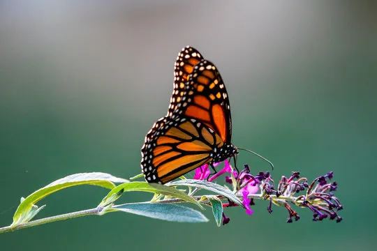
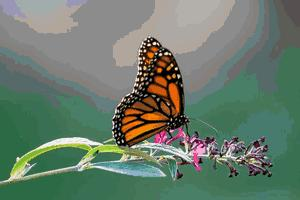
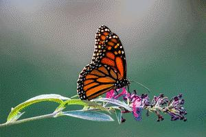

This project is aimed to make a PDF cross stitch pattern from an image.

Created pixel art (in the process of transforming into cross stitch pattern) without dither:

And the same pixel art, but with Floyd-Steinberg dithering:

Firstly, the image is resized to the final shape, then a dithering method is applied (there are two possible algorithms: Floyd-Steinberg's and Atkinson's). Finally, the number of colors is reduced using K-means clusterisation and each pixel (= stitch) is assigned to the closest existing DMC thread color.

To run, simply run command: python pattern_maker.py (the instructions will appear)

So far created PDF isn't fully supported by apps, such like Pattern Keeper.

TODO
- add symbols to the chart
- add table of used colors to the chart
- extend DMC table with blends (mixing threads of different colors, to get more shades)
- add other options of measuring distance between color (e.g. CIECAM02)
- long term: half-stitch support.
