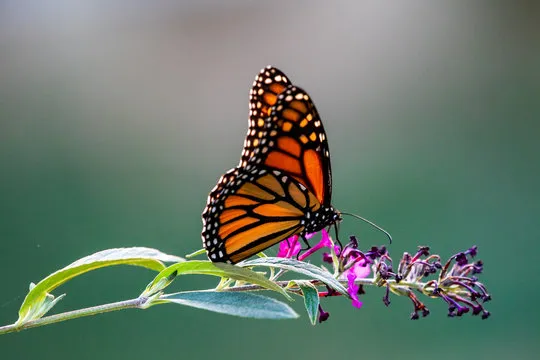
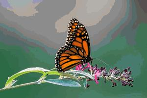
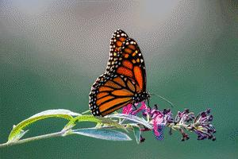

This project is aimed to make a PDF cross stitch pattern from an image.

<<<<<<< HEAD
To run it, copy the repo and run command: python3 app.py 
The instructions will appear in your browser.

App:
(./examples/homepage.png)

{./examples/additional_data.png}

Examples of algoritm in practice:

(./examples/butterfly.jpg)
=======

>>>>>>> 020602b2a3a4b46ab0d3aa63c9bfa050d8100232

Created pixel art (in the process of transforming into cross stitch pattern) without dither:

And the same pixel art, but with Floyd-Steinberg dithering:

Firstly, the image is resized to the final shape, then a dithering method is applied (there are two possible algorithms: Floyd-Steinberg's and Atkinson's). Finally, the number of colors is reduced using K-means clusterisation and each pixel (= stitch) is assigned to the closest existing DMC thread color.

So far created PDF isn't fully supported by apps, such like Pattern Keeper.

TODO
- add symbols to the chart
- add table of used colors to the chart
- extend DMC table with blends (mixing threads of different colors, to get more shades)
- add other options of measuring distance between color (e.g. CIECAM02)
- long term: half-stitch support.
